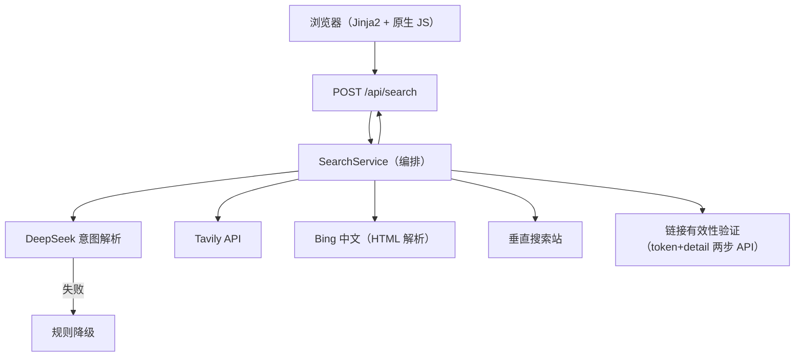

# QueryPilot

> 可解释的 AI 搜索与链接验证引擎 —— 用自然语言描述需求，系统理解意图、聚合多源检索结果，并对每条结果做**严格的有效性验证**。

**一句话亮点**：不是简单的"关键词搜索"，而是一条可观察的搜索流水线 —— LLM 意图解析 → 多引擎并发召回 → 去重排序 → 逐个验证结果是否真实可用。

---

## 为什么值得看（面向 FDE 面试官）

| 能力 | 实现 |
| --- | --- |
| **AI 集成与输出控制** | DeepSeek `deepseek-v4-flash` 解析自然语言（资源名/清晰度/别名/英文名 + 5~6 个查询变体）；LLM 输出经 `_coerce` 归一化 + **Pydantic 类型校验**后才进入下游，不可信 JSON 不会污染搜索层 |
| **URL 输入识别** | 直接粘贴**豆瓣链接**（`movie.douban.com/subject/<id>`），自动抓取移动版页面识别片名/年份/类型，再进入搜索链路 |
| **可换模型** | `.env` 里填 `LLM_BASE_URL` / `LLM_MODEL` / `LLM_API_KEY` 即可换成任何兼容 OpenAI chat/completions 格式的服务（硅基流动、OpenRouter、本地 Ollama 等），默认 DeepSeek 官方；只支持流式的中转站会自动切换成流式调用（`LLM_STREAM`） |
| **失败降级** | DeepSeek 超时/无 key/坏 JSON → 自动规则降级（关键词清洗 + 默认查询词），系统仍然可用；单个搜索引擎失败不影响其他引擎 |
| **多源聚合** | Tavily API + Bing 中文（HTML 解析，含跳转链接 base64 解码）+ 垂直搜索站，三路引擎**并发执行**、内部**受控并发**（Semaphore 限流），统一标准化为内部模型 |
| **严格结果验证** | 逆向目标平台分享页前端（share.js），两步 API 验证（token + detail）：区分「有效 / 已失效 / 待确认」，而不是只看 HTTP 200 壳页假象 |
| **资源质量识别** | 验证时保留分享文件列表，规则识别分辨率（4K/1080p/720p，文件名优先、单文件体积兜底）、HDR、片源（REMUX/BluRay/WEB-DL）、枪版、字幕、集数与体积；质量分参与排序，前端可按最低清晰度过滤 |
| **资源记忆** | SQLite 链接库记住每条验证结果：同一资源再次搜索时复用近期有效链接（足够多则跳过全网搜索，秒出结果），近期已失效链接直接跳过不占验证名额，后台定期复验旧链接；`GET /api/memory/stats` 查看统计 |
| **搜索 Agent** | 自研 tool-calling 循环（DeepSeek function calling，不依赖 agent 框架）：LLM 只决定下一步（查记忆 / 换词搜索 / 验证 / 结束），搜索、验证、质量识别、目标判断和预算（8 步 / 90 秒 / 90 次验证）由代码控制；结果不够时自动用别名、英文名、清晰度词补搜；无 key 或 LLM 出错时规则规划器无缝接管；SSE 实时推送每一步（`GET /api/agent/stream`） |
| **相关性与偏好** | 用分享标题与文件名校验是不是要找的那部（片名、年份、季数，支持「第1-3季」「S01-S06」范围），规则判不了的交给 LLM 批量判定；按浏览器保存偏好（默认最低清晰度作为 agent 目标、字幕/HDR 优先），用户复制过的链接排序加权 |
| **更多搜索源** | Telegram 公开频道（抓 `t.me/s/<频道>?q=` 网页预览，无需账号；可配代理）与自定义资源站（URL 模板，经 SSRF 校验），与原有引擎并发召回 |
| **对话式追问** | 结果下方可继续说「要第二季」「只要中字的」「4K 的呢」「再找找」：追问被解释为对上一轮条件的修改（有 key 用 LLM，否则规则），上一轮已验证链接直接复用，够了只筛选、不够再按新条件补搜 |
| **追剧订阅** | 借鉴 MoviePilot 的订阅思路（只借鉴设计，未使用其 GPL 代码）：订阅对象是影视条目（TMDB / 豆瓣识别，识别不到按关键词），电影与剧集分开，剧集按季订阅、总集数随 TMDB 更新、可设起止集；新订阅立即搜一次，之后定期（默认 6 小时）重搜，有资源、新集、更高清时提醒；开了自动转存就把网盘缺的集存进去，按网盘目录清点缺集，集齐后订阅完成并移入「订阅历史」（可一键重新订阅）；每个订阅可设清晰度要求、包含 / 排除关键词、暂停；可选 `NOTIFY_WEBHOOK` 推送到飞书/Slack 等机器人 |
| **一键转存** | 点「转存到网盘」弹出夸克扫码登录，每个用户存到自己的网盘：凭证按浏览器会话用 AES-256-GCM 加密入库（密钥 `COOKIE_SECRET` 或自动生成的密钥文件，只存会话哈希，浏览器只拿 HttpOnly 会话，可随时退出清除，过期自动清理）。另外保留部署者自用模式：有效链接旁的「转存到网盘」把分享整体保存到部署者自己的夸克网盘（token → detail → save → 轮询任务）。夸克 cookie 只放服务器 `.env` 的 `QUARK_COOKIE`，不入库、不打日志、不回显、不从网页接收；接口另需口令 `SAVE_TOKEN`，两者都配置才开启 |
| **转存自动分类** | 转存时识别电影/电视剧/动漫/综艺/纪录片和地区（华语/欧美/日韩），自动在网盘建目录，如 `QueryPilot/电视剧/国产剧/漫长的季节 (2023)`、`QueryPilot/电影/欧美`；先查 TMDB（`TMDB_API_KEY`）和豆瓣的影视资料，再由 LLM 结合资料决定分类与片名；没有 LLM 时按资料映射，资料都查不到才用文件名规则兜底，结果里会写明依据；`SAVE_CLASSIFY=false` 关闭 |
| **防 token 滥用** | 未登录按 IP、登录按账号限制每天 AI 搜索次数，用完自动降级为不耗 token 的基础搜索（不拒绝）；同一 IP 每天搜索总数上限；同一句搜索 60 分钟内直接复用结果；全站每天 token 预算到顶后全站降级；数值都在 `.env` 配置，`GET /api/quota` 查看剩余次数 |
| **账号分级** | 夸克扫码登录即账号，不另设用户名密码；未登录每天可免费搜索若干次（`ANON_DAILY_SEARCHES`），用完引导登录；追剧订阅需要登录，订阅跟着账号走（换浏览器也在）；可选邀请制（`INVITE_REQUIRED` + `INVITE_CODES`）；`GET /api/me` 返回登录状态与额度 |
| **站长后台** | `ADMIN_TOKEN` 保护的 `/api/admin/*` 接口：全站与每个账号/IP 的搜索次数、LLM 调用次数和 token 花费（今天、最近 14 天）；封禁 / 解封账号与 IP；给单个账号单独设每日 AI 次数；生成和删除邀请码 |
| **订阅自动转存** | 订阅可单独打开自动转存（默认关，需扫码登录）：发现新集或更高清版本时，用订阅者自己的夸克登录凭证把网盘里还没有的集（按 `S01E05`/`第5集` 等比对）存进自动分类的目录，不重复转存；登录失效时暂停并提醒一次，重新扫码后自动恢复 |
| **可观测性** | 每次请求返回 `request_id`、各 provider 状态/召回数/耗时、原始/去重数量、是否降级 |
| **工程质量** | 48 项 pytest（全部用 MockTransport 假客户端，不消耗真实 API）、ruff 全绿、GitHub Actions CI、Docker 多阶段构建（内置国内镜像源加速） |

## 架构



请求生命周期：输入校验 → 意图解析（LLM/降级）→ 引擎并发召回 → 提取候选结果 → 按唯一标识去重 → 并发验证 → 置信度排序 → 返回可解释响应。

## 技术栈

- **后端**：Python 3.12 · FastAPI · Pydantic v2 · HTTPX（异步）
- **AI**：DeepSeek Chat Completions（`deepseek-v4-flash`，OpenAI 兼容格式）
- **搜索**：Tavily Search API · Bing 中文 · 垂直搜索站（HTML 解析）
- **前端**：Jinja2 服务端渲染 + 原生 JavaScript/CSS（无构建步骤）
- **质量**：pytest + pytest-asyncio · Ruff
- **交付**：Docker · GitHub Actions · 国内轻量服务器（Nginx）

## 快速开始（本地开发）

```powershell
py -m venv .venv
.\.venv\Scripts\Activate.ps1
python -m pip install -r requirements-dev.txt
Copy-Item .env.example .env   # 填入 DEEPSEEK_API_KEY / TAVILY_API_KEY
python -m uvicorn app.main:app --reload
```

访问 `http://127.0.0.1:8000`，接口文档在 `/docs`（FastAPI OpenAPI）。

> 未配置 key 也能启动：意图解析走规则降级，无搜索源时返回受控 503。

## 开发命令

| 命令 | 用途 |
| --- | --- |
| `python -m uvicorn app.main:app --reload` | 启动本地服务 |
| `python -m pytest -q -p no:cacheprovider` | 运行 48 项测试 |
| `python -m ruff check app tests` | 静态检查 |
| `docker compose up -d --build` | 容器化部署 |

## 项目结构

```
app/
├─ main.py               # FastAPI 入口、路由、lifespan
├─ config.py             # 环境变量配置（密钥绝不落仓库）
├─ models.py             # Pydantic 数据契约
├─ providers/
│  ├─ base.py            # SearchProvider 接口 + 类型化错误
│  └─ tavily.py          # Tavily 适配器
├─ services/
│  ├─ intent.py          # DeepSeek 意图解析 + 规则降级
│  ├─ search.py          # 编排：并发、部分成功、验证、排序
│  └─ quark.py           # 结果提取、深度抓取、严格验证、Bing/垂直站引擎
├─ templates/            # 服务端渲染页面
└─ static/               # 原生 JS/CSS
tests/                   # 48 项测试（MockTransport，不调用真实 API）
```

## 在线 Demo

`http://124.223.112.9:8000`（部署于国内轻量服务器，Docker + Nginx）

## 项目文档

- [产品需求文档（PRD）](docs/PRD.md)
- [开发与架构文档](docs/DEVELOPMENT.md)
- [面试 Q&A 准备](docs/INTERVIEW.md)

## 部署（国内服务器）

```bash
cp .env.example .env   # 填入真实 key
docker compose up -d --build
curl http://127.0.0.1:8000/health
```

> Dockerfile 内置阿里云 pip 镜像加速（`PIP_INDEX_URL` build-arg），国内构建不再卡在默认 PyPI。

## 安全与合规

- API Key 只通过环境变量/服务器 `.env` 管理；`config.json`、`.env` 已被 Git 忽略，仓库历史零密钥；
- 本项目聚合**公开网络信息**并验证其可用性，不托管、不传播受版权保护的内容；
- 结果有效性由验证层客观判断，是否使用由用户自行决定；仅供学习与合规用途。

## License

[MIT](LICENSE)
