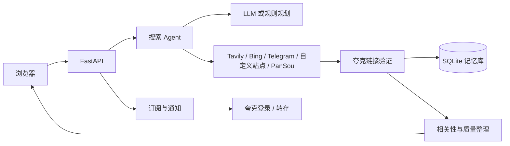

# QueryPilot

QueryPilot 是一个面向影视资源搜索的开源 Web 应用。用户输入片名、季数和清晰度等条件后，系统会解析搜索意图、从多个来源召回夸克网盘分享链接，验证链接状态并整理结果。项目还提供搜索记忆、订阅提醒、夸克扫码登录与自动转存。

## 功能

- **多源搜索**：组合 Tavily、Bing 中文、Telegram 公开频道、自定义资源站；可选接入 PanSou。搜索结果经过提取、去重、验证和质量判断。
- **AI Agent 与规则降级**：可使用 OpenAI Chat Completions 兼容接口规划搜索；LLM 不可用时使用规则规划。支持逐步 SSE 输出和基于上一轮结果的追问。
- **结果验证与排序**：通过夸克分享接口检查分享状态和文件列表，识别清晰度、HDR、片源、字幕、集数，并根据片名、年份和季数判断相关性。
- **SQLite 记忆库**：缓存链接验证结果、搜索记录、订阅、通知、用户设置与用量数据；后台可定期复验旧链接。
- **追剧订阅**：订阅电影、剧集季或系列，按配置定期检查更新；可设置清晰度、关键词过滤、自动转存和通知 Webhook。
- **夸克网盘操作**：用户可扫码登录并转存到自己的网盘；也支持部署者配置自用网盘。自动分类、缺集补存和订阅目录整理均由服务端处理。
- **账号与管理**：可配置邀请码、每日用量限制和管理员后台；管理员可查看用量、管理账号与 IP 封禁。
- **原生前端**：FastAPI/Jinja2 页面搭配原生 JavaScript 和 CSS，无前端构建步骤。

## 工作流程



## 技术栈

- Python 3.12、FastAPI、Pydantic v2、HTTPX
- SQLite
- Jinja2、原生 JavaScript、CSS
- pytest、pytest-asyncio、Ruff
- Docker Compose、GitHub Actions

## 本地运行

需要 Python 3.12。克隆仓库后创建虚拟环境并安装开发依赖：

```powershell
python -m venv .venv
.\.venv\Scripts\Activate.ps1
python -m pip install -r requirements-dev.txt
Copy-Item .env.example .env
```

macOS / Linux：

```bash
python3 -m venv .venv
source .venv/bin/activate
python -m pip install -r requirements-dev.txt
cp .env.example .env
```

按需编辑 `.env`，配置 LLM 和搜索服务密钥，然后启动：

```bash
python -m uvicorn app.main:app --reload
```

访问 <http://127.0.0.1:8000>。FastAPI 接口文档位于 `/docs`，健康检查接口为 `/health`。没有配置 LLM 密钥时会使用规则规划；需要联网搜索时，仍须有可用的搜索来源。

## 配置

完整变量和默认值见 [.env.example](.env.example)。常用配置如下：

| 变量 | 用途 |
| --- | --- |
| `DEEPSEEK_API_KEY` 或 `LLM_API_KEY` | LLM 密钥；也可通过 `LLM_BASE_URL` 和 `LLM_MODEL` 使用兼容接口 |
| `TAVILY_API_KEY` | 启用 Tavily 搜索来源 |
| `TMDB_API_KEY` | 影视条目识别、系列和播出日历 |
| `TG_CHANNELS`、`TG_PROXY` | 可选 Telegram 频道搜索及代理 |
| `EXTRA_SITES` | 可选自定义资源站 URL 模板，使用 `{q}` 作为搜索词占位符 |
| `PANSOU_URL`、`PANSOU_TOKEN` | 可选 PanSou 服务地址和访问令牌 |
| `MEMORY_DB_PATH` | SQLite 数据库路径；留空可关闭链接记忆 |
| `QUARK_LOGIN`、`COOKIE_SECRET` | 是否开放夸克扫码登录及登录凭证加密密钥 |
| `QUARK_COOKIE`、`SAVE_TOKEN` | 可选部署者自用转存凭证与接口口令；两者都配置才启用 |
| `ADMIN_TOKEN` | 管理员 API 口令；留空时管理接口关闭 |
| `RATE_LIMIT_PER_MINUTE`、`IP_DAILY_SEARCHES`、`ANON_DAILY_AI_SEARCHES`、`USER_DAILY_AI_SEARCHES`、`SITE_DAILY_TOKEN_BUDGET` | 请求与用量限制 |
| `TRUST_PROXY` | 应用位于可信反向代理后时，按转发头读取客户端 IP；直连公网时保持关闭 |

请勿提交 `.env`、API 密钥或网盘 Cookie。扫码登录返回的夸克凭证使用 AES-GCM 加密存入数据库；若未配置 `COOKIE_SECRET`，服务会在数据目录生成密钥文件。部署时应持久化数据库和该密钥文件，并通过 HTTPS 提供登录服务。

## Docker Compose 部署

```bash
cp .env.example .env
# 编辑 .env，填写所需配置
docker compose up -d --build
```

Compose 会启动 Web 服务和 PanSou 容器；只有配置 `PANSOU_URL` 后，QueryPilot 才会调用 PanSou。容器内数据保存在 `querypilot-data` 卷中。生产环境建议在可信反向代理后提供 HTTPS，并限制外部直接访问应用端口。

## 常用接口

| 接口 | 用途 |
| --- | --- |
| `POST /api/search` | 普通资源搜索 |
| `POST /api/agent/search` | Agent 搜索并返回执行步骤 |
| `GET /api/agent/stream?query=...` | SSE 流式搜索 |
| `GET /api/trending` | 获取热门影视 |
| `GET /api/media/search?q=...` | 搜索影视条目 |
| `/api/subscriptions` | 创建、查询和管理订阅；详见 `/docs` |
| `GET /api/calendar` | 获取订阅播出日历 |
| `GET /api/quota`、`GET /api/me` | 当前身份和用量状态 |
| `/api/admin/*` | 管理员用量与账号管理接口 |

完整请求字段和响应结构以 `/docs` 中的 OpenAPI 文档为准。

## 测试与代码检查

```bash
python -m pytest -q -p no:cacheprovider
python -m ruff check app tests
```

测试为静态仓库的一部分；CI 工作流会在推送和 Pull Request 时运行测试、Ruff 检查及 Docker 构建。

## GitHub Actions 触发规则

- `.github/workflows/ci.yml` 对所有分支的 `push` 和 Pull Request 触发，没有按文件路径过滤。因此，**只修改 README 并推送也会运行 CI**。
- `.github/workflows/deploy.yml` 只在向 `main` 推送时触发，并通过 SSH 在服务器执行部署。因此，推送 README 到 `main` 也会触发部署。

## 项目结构

```text
app/
├── main.py                 # FastAPI 应用、路由和生命周期
├── admin.py                # 管理员 API
├── config.py               # 环境变量配置
├── models.py               # 请求、响应和领域模型
├── providers/              # 搜索提供方接口与适配器
├── services/               # 搜索、Agent、验证、记忆、订阅、夸克登录与转存
├── templates/              # Jinja2 页面
└── static/                 # 前端 JavaScript、CSS 和管理员页面
tests/                      # 自动化测试
evals/                      # 搜索评测与合成数据
docs/                       # PRD、开发文档与设计决策
quark_search_gui.py         # 旧版 Tkinter 原型，仅供参考
```

## 许可证

[MIT](LICENSE)

## 独立设计系统

设计系统已迁至 [cz-design-system](https://github.com/czczccc/cz-design-system)，本仓库通过 Git 子模块固定引用其版本。

首次克隆：

```bash
git clone --recurse-submodules https://github.com/czczccc/QueryPilot.git
```

已有克隆在拉取本次变更后，先初始化子模块再执行 Docker 或前端构建：

```bash
git submodule update --init --recursive
```

开发设计系统请在独立仓库提交。升级后在 QueryPilot 提交子模块的新 commit 指针，不自动追踪上游 main。
