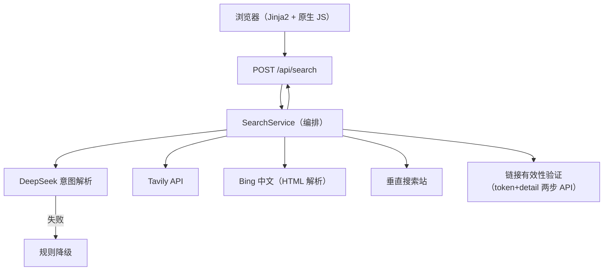

# QueryPilot

> 可解释的 AI 搜索与链接验证引擎 —— 用自然语言描述需求，系统理解意图、聚合多源检索结果，并对每条结果做**严格的有效性验证**。

**一句话亮点**：不是简单的"关键词搜索"，而是一条可观察的搜索流水线 —— LLM 意图解析 → 多引擎并发召回 → 去重排序 → 逐个验证结果是否真实可用。

---

## 为什么值得看（面向 FDE 面试官）

| 能力 | 实现 |
| --- | --- |
| **AI 集成与输出控制** | DeepSeek `deepseek-v4-flash` 解析自然语言（资源名/清晰度/别名/英文名 + 5~6 个查询变体）；LLM 输出经 `_coerce` 归一化 + **Pydantic 类型校验**后才进入下游，不可信 JSON 不会污染搜索层 |
| **URL 输入识别** | 直接粘贴**豆瓣链接**（`movie.douban.com/subject/<id>`），自动抓取移动版页面识别片名/年份/类型，再进入搜索链路 |
| **失败降级** | DeepSeek 超时/无 key/坏 JSON → 自动规则降级（关键词清洗 + 默认查询词），系统仍然可用；单个搜索引擎失败不影响其他引擎 |
| **多源聚合** | Tavily API + Bing 中文（HTML 解析，含跳转链接 base64 解码）+ 垂直搜索站，三路引擎**并发执行**、内部**受控并发**（Semaphore 限流），统一标准化为内部模型 |
| **严格结果验证** | 逆向目标平台分享页前端（share.js），两步 API 验证（token + detail）：区分「有效 / 已失效 / 待确认」，而不是只看 HTTP 200 壳页假象 |
| **资源质量识别** | 验证时保留分享文件列表，规则识别分辨率（4K/1080p/720p，文件名优先、单文件体积兜底）、HDR、片源（REMUX/BluRay/WEB-DL）、枪版、字幕、集数与体积；质量分参与排序，前端可按最低清晰度过滤 |
| **可观测性** | 每次请求返回 `request_id`、各 provider 状态/召回数/耗时、原始/去重数量、是否降级 |
| **工程质量** | 48 项 pytest（全部用 MockTransport 假客户端，不消耗真实 API）、ruff 全绿、GitHub Actions CI、Docker 多阶段构建（内置国内镜像源加速） |

## 架构



请求生命周期：输入校验 → 意图解析（LLM/降级）→ 引擎并发召回 → 提取候选结果 → 按唯一标识去重 → 并发验证 → 置信度排序 → 返回可解释响应。

## 技术栈

- **后端**：Python 3.12 · FastAPI · Pydantic v2 · HTTPX（异步）
- **AI**：DeepSeek Chat Completions（`deepseek-v4-flash`，OpenAI 兼容格式）
- **搜索**：Tavily Search API · Bing 中文 · 垂直搜索站（HTML 解析）
- **前端**：Jinja2 服务端渲染 + 原生 JavaScript/CSS（无构建步骤）
- **质量**：pytest + pytest-asyncio · Ruff
- **交付**：Docker · GitHub Actions · 国内轻量服务器（Nginx）

## 快速开始（本地开发）

```powershell
py -m venv .venv
.\.venv\Scripts\Activate.ps1
python -m pip install -r requirements-dev.txt
Copy-Item .env.example .env   # 填入 DEEPSEEK_API_KEY / TAVILY_API_KEY
python -m uvicorn app.main:app --reload
```

访问 `http://127.0.0.1:8000`，接口文档在 `/docs`（FastAPI OpenAPI）。

> 未配置 key 也能启动：意图解析走规则降级，无搜索源时返回受控 503。

## 开发命令

| 命令 | 用途 |
| --- | --- |
| `python -m uvicorn app.main:app --reload` | 启动本地服务 |
| `python -m pytest -q -p no:cacheprovider` | 运行 48 项测试 |
| `python -m ruff check app tests` | 静态检查 |
| `docker compose up -d --build` | 容器化部署 |

## 项目结构

```
app/
├─ main.py               # FastAPI 入口、路由、lifespan
├─ config.py             # 环境变量配置（密钥绝不落仓库）
├─ models.py             # Pydantic 数据契约
├─ providers/
│  ├─ base.py            # SearchProvider 接口 + 类型化错误
│  └─ tavily.py          # Tavily 适配器
├─ services/
│  ├─ intent.py          # DeepSeek 意图解析 + 规则降级
│  ├─ search.py          # 编排：并发、部分成功、验证、排序
│  └─ quark.py           # 结果提取、深度抓取、严格验证、Bing/垂直站引擎
├─ templates/            # 服务端渲染页面
└─ static/               # 原生 JS/CSS
tests/                   # 48 项测试（MockTransport，不调用真实 API）
```

## 在线 Demo

`http://124.223.112.9:8000`（部署于国内轻量服务器，Docker + Nginx）

## 项目文档

- [产品需求文档（PRD）](docs/PRD.md)
- [开发与架构文档](docs/DEVELOPMENT.md)
- [面试 Q&A 准备](docs/INTERVIEW.md)

## 部署（国内服务器）

```bash
cp .env.example .env   # 填入真实 key
docker compose up -d --build
curl http://127.0.0.1:8000/health
```

> Dockerfile 内置阿里云 pip 镜像加速（`PIP_INDEX_URL` build-arg），国内构建不再卡在默认 PyPI。

## 安全与合规

- API Key 只通过环境变量/服务器 `.env` 管理；`config.json`、`.env` 已被 Git 忽略，仓库历史零密钥；
- 本项目聚合**公开网络信息**并验证其可用性，不托管、不传播受版权保护的内容；
- 结果有效性由验证层客观判断，是否使用由用户自行决定；仅供学习与合规用途。

## License

[MIT](LICENSE)
