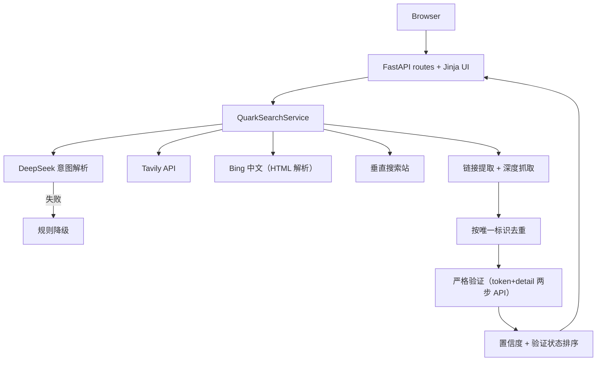

# QueryPilot 开发与架构文档

本文档描述 QueryPilot 的工程结构、接口契约、实现约束和部署方式。当前 Web 版本已实现并部署；架构变化应先更新本文档与 PRD。

## 1. 架构目标

- 在单个可部署服务内完成页面、API、搜索编排与结果验证；
- 将第三方依赖隔离在适配器中，避免核心逻辑绑定供应商；
- 外部服务部分失败时返回已有结果，而不是让整个请求失败；
- 结果在展示前完成严格有效性验证，而不是依赖 HTTP 状态码假象；
- 搜索过程可解释、可测试、可观察。

## 2. 技术栈

| 层 | 选择 | 说明 |
| --- | --- | --- |
| Runtime | Python 3.11+（本地 3.12 验证） | 与桌面原型一致，生态成熟 |
| Web | FastAPI | 类型化 API、OpenAPI、异步支持 |
| Validation | Pydantic v2 | 校验用户输入和 LLM 输出 |
| UI | Jinja2 + 原生 JS/CSS | 单体部署，减少前后端构建复杂度 |
| AI | DeepSeek Chat Completions | 影视资源解析与查询改写（`deepseek-v4-flash`） |
| Search | Tavily API + Bing 中文 + 垂直搜索站 | 多源聚合，统一接口 |
| HTTP | HTTPX | 异步请求、超时和连接池 |
| Tests | pytest + pytest-asyncio | 单元、编排与 API 测试（MockTransport） |
| Quality | Ruff | 快速 lint 与格式检查 |
| Delivery | Docker + GitHub Actions + 国内轻量服务器 | 可复现构建与在线演示 |

具体取舍记录在 [`decisions/0001-web-mvp-architecture.md`](decisions/0001-web-mvp-architecture.md)。

## 3. 系统结构



### 3.1 请求生命周期

1. Web 层校验输入（2–200 字符）并生成 `request_id`；
2. `DeepSeekParser` 解析资源信息（资源名/清晰度/别名/英文名/查询变体），失败进入规则降级；
3. `QuarkSearchService` 三路引擎受控并发检索：Tavily（多查询 + 深度抓取）、Bing 中文、垂直搜索站；
4. 从搜索结果 URL、摘要、正文提取目标平台分享链接与提取码；
5. 按唯一分享标识去重；
6. 并发严格验证每条链接（token + detail 两步 API），标记 `valid/invalid/unknown`；
7. 按验证状态与置信度排序，返回链接清单、引擎状态与指标；
8. 日志以 `request_id` 串联各阶段，但不记录密钥。

## 4. 目录结构

```text
quark-search-tool/
├─ app/
│  ├─ main.py                 # FastAPI 入口、路由、create_app 工厂
│  ├─ config.py               # 环境变量配置（.env 加载，密钥不落仓库）
│  ├─ models.py               # Pydantic 请求、响应与领域模型
│  ├─ providers/
│  │  ├─ base.py              # SearchProvider Protocol + ProviderError
│  │  └─ tavily.py            # Tavily 适配器（Bearer 认证、错误映射）
│  ├─ services/
│  │  ├─ intent.py            # DeepSeek 影视解析 + _coerce 归一化 + 规则降级
│  │  ├─ search.py            # QuarkSearchService：编排、并发、部分成功、验证
│  │  └─ quark.py             # 链接提取、深度抓取、严格验证、Bing/垂直站引擎
│  ├─ templates/index.html    # 单页搜索界面
│  └─ static/
│     ├─ app.js               # 原生 JS（防 XSS、复制、过滤开关）
│     └─ styles.css
├─ tests/
│  ├─ test_api.py             # API 契约与状态码
│  ├─ test_intent.py          # LLM 解析与降级
│  ├─ test_providers.py       # Tavily 适配器
│  ├─ test_quark.py           # 提取/置信度/验证/Bing/垂直站
│  └─ test_search_service.py  # 编排：部分成功、去重、验证
├─ docs/
├─ tasks/
├─ .env.example
├─ .gitignore
├─ Dockerfile
├─ docker-compose.yml
├─ pyproject.toml
├─ requirements.txt
├─ requirements-dev.txt
└─ README.md
```

## 5. 领域模型

模型名称使用名词，服务方法使用动词；所有第三方数据进入核心层前必须完成类型转换。

```python
from pydantic import BaseModel, Field


class SearchRequest(BaseModel):
    query: str = Field(min_length=2, max_length=200)


class ParsedResource(BaseModel):
    resource: str
    quality: str | None = None
    preference: str | None = None
    aliases: list[str] = Field(default_factory=list, max_length=8)
    english_name: str | None = None
    search_suggestions: list[str] = Field(min_length=1, max_length=6)


class QuarkLink(BaseModel):
    name: str
    share: str            # 分享唯一标识
    pwd: str | None       # 提取码
    source: str
    time: str
    conf: str = "中"      # 置信度：高/中/低
    http: int | None      # 壳页状态码
    state: str = "unknown"  # 严格验证状态：valid / invalid / unknown
```

`ProviderStatus`、`SearchMetrics` 和完整 `QuarkSearchResponse` 按 PRD 数据契约实现。响应中不得包含供应商原始对象或异常堆栈。

## 6. 核心接口

### 6.1 搜索提供方

```python
from typing import Protocol


class SearchProvider(Protocol):
    name: str

    async def search(self, query: str, limit: int) -> list[RawSearchResult]:
        """返回统一原始结果，或抛类型化 ProviderError。"""
```

实现约束：

- 适配器只负责认证、请求、供应商字段转换和供应商错误映射；
- 超时由调用端注入，不在业务逻辑中散落魔法数字；
- 供应商 HTTP 错误转换成 `ProviderError`，日志不得包含认证头。

### 6.2 意图解析器

```python
class IntentParser(Protocol):
    async def parse(self, query: str) -> ParseOutcome:
        """返回 ParsedResource 与是否使用了降级。"""
```

DeepSeek 响应先解析 JSON，再经 `_coerce` 归一化（截断超限字段、过滤空值）后通过 `ParsedResource.model_validate` 校验。任何解析、超时、限流、字段越界或缺少资源名/查询建议的错误都进入规则降级：`clean_keyword` 清洗停用词 + 生成 4~6 个默认查询词。

### 6.3 QuarkSearchService

`QuarkSearchService.search()` 是唯一编排入口，负责：

- 调用意图解析器；
- 三路引擎受控并发（`asyncio.Semaphore` 限制任务数）；
- Tavily 结果深度抓取（上限 10 页、4 路并发、跳过反爬域名）；
- 按分享唯一标识去重；
- 并发严格验证（8 路限流、8 秒超时）；
- 汇总 `ProviderStatus` 与阶段耗时；
- 全部引擎失败时抛出可映射的 `SearchUnavailableError`。

### 6.4 严格验证（quark.verify_quark）

逆向目标平台分享页前端（share.js v4.6.3）得到两步 API：

1. `POST /1/clouddrive/share/sharepage/token`：`{pwd_id, passcode, support_visit_limit_private_share}` → 获取 `stoken`；分享不存在/已失效返回 HTTP 404（code 41006/41011）；
2. `GET /1/clouddrive/share/sharepage/detail`：带 `stoken` 查文件列表，`data.list` 非空且 `share.status == 1` 判 `valid`，否则 `invalid`。

网络异常或 JSON 解析失败判 `unknown`。此验证取代旧的"HTTP 200 = 可达"弱验证（壳页假象）。

## 7. API 设计

### `GET /`

返回服务端渲染的搜索页面。

### `POST /api/search`

请求：`SearchRequest`。成功返回 `QuarkSearchResponse`。

| 状态码 | 场景 |
| --- | --- |
| 200 | 成功、部分成功或合法的空结果 |
| 422 | 输入不符合长度或类型约束 |
| 503 | 所有搜索引擎均不可用 |

部分成功必须返回 200，并在 `providers` 中明确失败来源；这能让前端保留可用结果。

### `GET /health`

```json
{"status": "ok", "version": "0.2.0"}
```

健康检查只证明应用进程可响应。外部 API 可用性不放在基础健康检查中，避免短暂第三方故障导致部署平台反复重启实例。

## 8. 去重、排序与置信度

### 8.1 去重

- 按分享唯一标识（share id）去重，相同标识只保留第一条；
- 深度抓取与多引擎来源自然合并。

### 8.2 置信度

- 高/中/低，基于来源发布时间新鲜度（30 天/180 天阈值）；
- 来源无时间信息时为"中"。

### 8.3 排序

```text
排序键 = (验证状态: valid=0, unknown=1, invalid=2)
      + (置信度: 高=0, 中=1, 低=2)
      + (分享标识, 稳定排序)
```

有效链接优先展示，失效链接置底（前端默认隐藏）。

## 9. 配置与密钥

环境变量：

| 变量 | 必需 | 默认值 | 用途 |
| --- | --- | --- | --- |
| `DEEPSEEK_API_KEY` | 否 | 空 | 为空时使用规则解析 |
| `TAVILY_API_KEY` | 否 | 空 | 为空时无 API 搜索源，Bing/垂直站仍可用 |
| `APP_ENV` | 否 | `development` | 运行环境 |
| `LOG_LEVEL` | 否 | `INFO` | 日志等级 |
| `REQUEST_TIMEOUT_SECONDS` | 否 | `8` | 单个外部调用超时 |
| `MAX_RESULTS` | 否 | `12` | 最终结果上限 |

规则：

- 本地使用 `.env`，线上使用服务器环境变量或 Secret 管理；
- `.env.example` 只包含变量名和安全示例；
- 禁止从 `config.json` 读取真实密钥；
- 首次公开提交前轮换旧密钥并运行秘密扫描（已完成，git 历史零密钥）。

## 10. 错误处理与日志

定义少量稳定错误类型：`IntentError`、`ProviderError`、`SearchUnavailableError`。路由层只负责将领域错误映射为 API 响应。

每次请求的结构化日志至少包含：

```text
request_id, event, provider, status, duration_ms, result_count, fallback_used
```

不得记录：API Key、Authorization 头、完整第三方响应、用户 Cookie。

## 11. 测试策略

### 11.1 单元测试

- LLM 合法 JSON、非法 JSON、HTTP 错误、超时与无 key 降级；
- `_coerce` 归一化（字段截断、非法类型映射、必填缺失）；
- 分享链接正则提取与去重、提取码识别、置信度计算；
- Bing 结果页解析（含标题内嵌链接的新版结构）；
- 严格验证各分支（valid / invalid / unknown）。

### 11.2 服务测试

- 多引擎均成功、部分失败、全部失败；
- 按分享标识去重；
- 深度抓取补充链接；
- 验证状态写入。

### 11.3 API 测试

- `/health` 返回 200；
- `/api/search` 对空、过短和超长输入返回 422；
- 成功响应符合 OpenAPI 模型；
- 503 响应不包含内部异常或密钥。

测试不得调用真实 DeepSeek 或 Tavily；全部使用依赖注入 + `httpx.MockTransport` 假客户端，保证快速、确定且不消耗额度（48 项）。上线前另做一次手工 smoke test。

## 12. 本地开发命令

```powershell
py -m venv .venv
.\.venv\Scripts\Activate.ps1
python -m pip install -r requirements-dev.txt
Copy-Item .env.example .env
python -m uvicorn app.main:app --reload
```

质量检查：

```powershell
python -m pytest -q -p no:cacheprovider
python -m ruff check app tests
docker compose up -d --build
```

## 13. 部署

国内轻量服务器（阿里云/腾讯云，Debian 12 验证）：

- 运行方式：Docker + `docker compose`；
- 反向代理：Nginx 监听 80/443，转发到容器 8000；
- 健康检查：`/health`（供云平台或 Nginx 使用）；
- 环境变量：写入服务器 `.env` 或容器 Secret，不落仓库；
- HTTPS：域名 + 平台免费证书；绑定域名且使用国内服务器时，需按平台要求完成 ICP 备案，仅 IP 访问或测试用途可暂缓；
- 国内构建加速：Dockerfile 内置 `ARG PIP_INDEX_URL=https://mirrors.aliyun.com/pypi/simple/`（compose build.args 同步），默认 PyPI 在国内只有 ~34KB/s。

上线验证：

1. `/health` 返回 200；
2. 三个示例查询至少各成功一次并返回已验证链接；
3. 移除 DeepSeek Key 后规则降级可用；
4. 日志中不存在密钥或认证头；
5. GitHub Actions 对当前提交显示通过。

## 14. 从桌面原型迁移

| 原型能力 | Web 版处理方式 |
| --- | --- |
| `llm_parse` | 重写为异步、类型校验的 `DeepSeekParser`（ParsedResource） |
| Tavily 多查询 + 深度抓取 | 迁入 `_tavily_pipeline`（httpx 异步、并发限流） |
| Bing HTML 抓取 | 迁入 `search_bing`（已适配新版 h2 内嵌链接结构） |
| 夸克链接提取 | 迁入 `quark.py`（QUARK_RE/PWD_RE 纯函数） |
| 夸克云搜 | 迁入 `search_qkyunso`（详情并发抓取） |
| 链接验证（HTTP 状态码弱验证） | 升级为两步 API 严格验证（token + detail） |
| 结果去重 | 按分享唯一标识去重 |
| Tkinter UI | 替换为 Jinja2 页面 + 原生 JS |
| `config.json` | 停止使用，改为环境变量 |

## 15. 工程边界

### 始终执行

- 修改行为前更新相应测试；
- 外部数据进入领域层前完成校验；
- 提交前运行测试、lint 和秘密扫描；
- 保持 README、PRD、开发文档与实现同步。

### 需要先确认

- 新增付费依赖或需要新密钥的数据源；
- 引入数据库、身份认证或用户数据存储；
- 修改公开 API 契约；
- 更换部署平台或拆分前后端服务。

### 永远不要

- 提交密钥、`.env` 或含真实凭据的配置；
- 在测试中调用真实付费 API；
- 向用户展示内部堆栈或认证信息；
- 为扩大结果量而忽略第三方服务条款。
