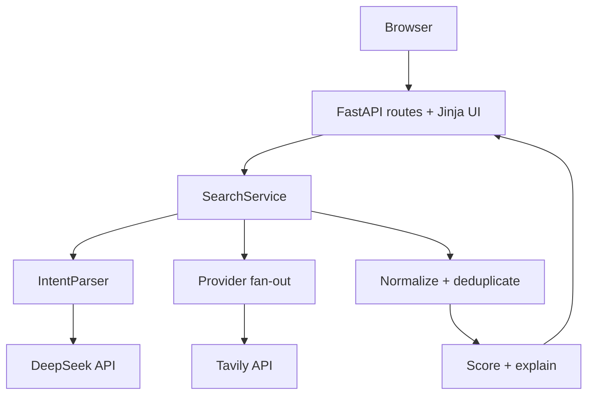

# QueryPilot 开发与架构文档

本文档描述 QueryPilot 目标 Web MVP 的工程结构、接口契约、实现约束和部署方式。当前代码仍处于桌面原型向 Web 应用迁移阶段；实现时以 PRD 和本文件为准，架构变化应先更新文档。

## 1. 架构目标

- 在单个可部署服务内完成页面、API 和搜索编排；
- 将第三方依赖隔离在适配器中，避免核心逻辑绑定供应商；
- 外部服务部分失败时返回已有结果，而不是让整个请求失败；
- 搜索过程可解释、可测试、可观察；
- 在 2–3 小时 MVP 约束下优先可用性和清晰度。

## 2. 技术栈

| 层 | 选择 | 说明 |
| --- | --- | --- |
| Runtime | Python 3.11+ | 与现有原型一致，生态成熟 |
| Web | FastAPI | 类型化 API、OpenAPI、异步支持 |
| Validation | Pydantic v2 | 校验用户输入和 LLM 输出 |
| UI | Jinja2 + 原生 JS/CSS | 单体部署，减少前后端构建复杂度 |
| AI | DeepSeek Chat Completions | 意图解析和查询改写 |
| Search | Tavily | 通用搜索源（接口预留多源扩展） |
| HTTP | HTTPX | 异步请求、超时和连接池 |
| Tests | pytest + pytest-asyncio | 核心、适配器和 API 测试 |
| Quality | Ruff | 快速 lint 与格式检查 |
| Delivery | Docker + GitHub Actions + 国内轻量服务器 | 可复现构建与在线演示 |

具体取舍记录在 [`decisions/0001-web-mvp-architecture.md`](decisions/0001-web-mvp-architecture.md)。

## 3. 系统结构



### 3.1 请求生命周期

1. Web 层验证输入并生成 `request_id`；
2. `IntentParser` 调用 DeepSeek，失败则进入规则降级；
3. `SearchService` 将查询变体分发给启用的提供方；
4. 每个适配器将供应商响应转换成 `RawSearchResult`；
5. 聚合层规范化 URL、去重、评分并截取前 N 条；
6. API 返回结果、提供方状态和阶段耗时；
7. 日志以 `request_id` 串联各阶段，但不记录密钥。

## 4. 目标目录结构

```text
quark-search-tool/
├─ app/
│  ├─ main.py                 # FastAPI 创建、路由与生命周期
│  ├─ config.py               # 环境变量和运行配置
│  ├─ models.py               # Pydantic 请求、响应与领域模型
│  ├─ services/
│  │  ├─ intent.py            # AI 解析和规则降级
│  │  ├─ search.py            # 搜索编排、并发和部分成功
│  │  └─ ranking.py           # URL 规范化、去重、评分和解释
│  ├─ providers/
│  │  ├─ base.py              # SearchProvider Protocol/ABC
│  │  └─ tavily.py            # Tavily 适配器
│  ├─ templates/
│  │  └─ index.html           # 单页搜索界面
│  └─ static/
│     ├─ app.js
│     └─ styles.css
├─ tests/
│  ├─ test_api.py
│  ├─ test_intent.py
│  ├─ test_ranking.py
│  └─ test_search_service.py
├─ docs/
├─ tasks/
├─ .env.example
├─ .gitignore
├─ Dockerfile
├─ pyproject.toml
├─ requirements.txt
└─ README.md
```

## 5. 领域模型

模型名称使用名词，服务方法使用动词；所有第三方数据进入核心层前必须完成类型转换。

```python
from typing import Literal

from pydantic import BaseModel, Field, HttpUrl


class SearchRequest(BaseModel):
    query: str = Field(min_length=2, max_length=200)


class SearchIntent(BaseModel):
    resource_type: Literal["game", "movie", "music", "software", "other"]
    keywords: list[str] = Field(min_length=1, max_length=8)
    constraints: list[str] = Field(default_factory=list, max_length=8)
    query_variants: list[str] = Field(min_length=1, max_length=3)


class SearchResult(BaseModel):
    title: str
    url: HttpUrl
    snippet: str
    sources: list[str]
    score: int = Field(ge=0, le=100)
    reason: str
```

`ProviderStatus`、`SearchMetrics` 和完整 `SearchResponse` 按 PRD 数据契约实现。响应中不得包含供应商原始对象或异常堆栈。

## 6. 核心接口

### 6.1 搜索提供方

```python
from typing import Protocol


class SearchProvider(Protocol):
    name: str

    async def search(self, query: str, limit: int) -> list[RawSearchResult]:
        """Return normalized raw results or raise a typed provider error."""
```

实现约束：

- 适配器只负责认证、请求、供应商字段转换和供应商错误映射；
- 超时由调用端注入，不在业务逻辑中散落魔法数字；
- 供应商 HTTP 错误转换成 `ProviderError`，日志不得包含认证头。

### 6.2 意图解析器

```python
class IntentParser(Protocol):
    async def parse(self, query: str) -> ParseOutcome:
        """Return validated intent and whether fallback was used."""
```

DeepSeek 响应先解析 JSON，再通过 `SearchIntent.model_validate` 校验。任何解析、超时、限流或字段越界错误都进入规则降级：保留原始查询，并基于资源类型词典最多生成 3 个变体。

### 6.3 SearchService

`SearchService.search()` 是唯一编排入口，负责：

- 调用意图解析器；
- 使用 `asyncio.gather(..., return_exceptions=True)` 受控并发；
- 限制“查询变体 × 提供方”的最大任务数；
- 汇总 `ProviderStatus` 和阶段耗时；
- 调用纯函数完成规范化、去重和排序；
- 当全部提供方失败时抛出可映射的 `SearchUnavailableError`。

## 7. API 设计

### `GET /`

返回服务端渲染的搜索页面。

### `POST /api/search`

请求：`SearchRequest`。成功返回 `SearchResponse`。

| 状态码 | 场景 |
| --- | --- |
| 200 | 成功、部分成功或合法的空结果 |
| 422 | 输入不符合长度或类型约束 |
| 429 | 公开部署触发速率限制（P1） |
| 503 | 所有搜索提供方均不可用 |

部分成功必须返回 200，并在 `providers` 中明确失败来源；这能让前端保留可用结果。

### `GET /health`

```json
{"status": "ok", "version": "0.1.0"}
```

健康检查只证明应用进程可响应。外部 API 可用性不放在基础健康检查中，避免短暂第三方故障导致部署平台反复重启实例。

## 8. 去重与排序

### 8.1 URL 规范化

规范化规则必须是纯函数并有固定测试：

1. scheme 和 host 转小写；
2. 移除 fragment；
3. 移除 `utm_*`、`gclid`、`fbclid` 等追踪参数；
4. 查询参数稳定排序；
5. 非根路径移除末尾 `/`；
6. 仅接受 `http` 和 `https`。

### 8.2 合并规则

- 规范 URL 相同视为同一结果；
- 标题或摘要更完整的条目作为主记录；
- `sources` 合并并去重；
- 不通过模糊标题直接合并，避免误伤不同页面。

### 8.3 MVP 评分

评分为启发式结果，不宣称是真实质量概率：

```text
score = keyword_coverage * 55
      + provider_relevance * 30
      + content_completeness * 15
```

- `keyword_coverage`：关键词在标题和摘要中的覆盖率；
- `provider_relevance`：供应商给出的相关性，缺失时使用中性值；
- `content_completeness`：标题、摘要和有效 URL 是否完整；
- 最终分数限制在 0–100，并按分数、标题稳定排序。

匹配理由由确定性模板生成，例如“标题和摘要覆盖 3/4 个关键词；来自 2 个来源”。MVP 不为每条结果再次调用 LLM，以控制延迟和成本。

## 9. 配置与密钥

计划中的环境变量：

| 变量 | 必需 | 默认值 | 用途 |
| --- | --- | --- | --- |
| `DEEPSEEK_API_KEY` | 否 | 空 | 为空时使用规则解析 |
| `TAVILY_API_KEY` | 否 | 空 | 为空时无可用搜索源，搜索返回 503 |
| `APP_ENV` | 否 | `development` | 运行环境 |
| `LOG_LEVEL` | 否 | `INFO` | 日志等级 |
| `REQUEST_TIMEOUT_SECONDS` | 否 | `8` | 单个外部调用超时 |
| `MAX_RESULTS` | 否 | `12` | 最终结果上限 |

规则：

- 本地使用 `.env`，线上使用服务器环境变量或 Secret 管理；
- `.env.example` 只包含变量名和安全示例；
- 禁止继续从 `config.json` 读取真实密钥；
- 首次公开提交前轮换旧密钥并运行秘密扫描。

## 10. 错误处理与日志

定义少量稳定错误类型：`IntentParseError`、`ProviderError`、`SearchUnavailableError`。路由层只负责将领域错误映射为 API 响应。

每次请求的结构化日志至少包含：

```text
request_id, event, provider, status, duration_ms, result_count, fallback_used
```

不得记录：API Key、Authorization 头、完整第三方响应、用户 Cookie。MVP 可以记录查询字符数和资源类型；公开环境是否记录原始查询需要显式决定。

## 11. 测试策略

### 11.1 单元测试

- LLM 合法 JSON、非法 JSON和超时降级；
- URL 规范化和追踪参数去除；
- 重复结果合并与来源聚合；
- 评分边界、稳定排序和匹配理由。

### 11.2 服务测试

- 两个提供方均成功；
- 一个成功、一个失败时部分成功；
- 全部失败时抛出受控错误；
- 查询任务数量受上限控制。

### 11.3 API 测试

- `/health` 返回 200；
- `/api/search` 对空、过短和超长输入返回 422；
- 成功响应符合 OpenAPI 模型；
- 503 响应不包含内部异常或密钥。

测试不得调用真实 DeepSeek 或 Tavily；使用依赖注入和假适配器保证快速、确定且不消耗额度。上线前另做一次手工 smoke test。

## 12. 本地开发命令

以下命令在 Web 脚手架实现后生效：

```powershell
py -m venv .venv
.\.venv\Scripts\Activate.ps1
python -m pip install -r requirements.txt
Copy-Item .env.example .env
python -m uvicorn app.main:app --reload
```

质量检查：

```powershell
python -m pytest -q
python -m ruff check .
docker build -t querypilot .
```

## 13. 部署

国内轻量服务器（阿里云/腾讯云，Ubuntu 22.04+）目标配置：

- 运行方式：Docker + `docker compose`（或 systemd 托管容器）；
- 反向代理：Nginx 监听 80/443，转发到容器 8000；
- 健康检查：`/health`（供云平台或 Nginx 使用）；
- 环境变量：写入服务器 `.env` 或容器 Secret，不落仓库；
- HTTPS：域名 + 平台免费证书；绑定域名且使用国内服务器时，需按平台要求完成 ICP 备案，仅 IP 访问或测试用途可暂缓。

上线验证：

1. `/health` 返回 200；
2. 三个示例查询至少各成功一次；
3. 移除 DeepSeek Key 后规则降级可用；
4. 日志中不存在密钥或认证头；
5. GitHub Actions 对当前提交显示通过。

## 14. 从桌面原型迁移

| 原型能力 | Web MVP 处理方式 |
| --- | --- |
| `llm_parse` | 重写为异步、类型校验的 `IntentParser` |
| Tavily 多查询 | 迁入 `TavilyProvider`，增加超时和错误映射 |
| Bing HTML 抓取 | MVP 不迁移，避免脆弱解析和条款风险 |
| 夸克链接提取 | 不迁移，通用化并降低版权风险 |
| 结果去重 | 重写为可测试的 URL 规范化纯函数 |
| Tkinter UI | 替换为 Jinja2 页面和 JSON API |
| `config.json` | 停止使用，改为环境变量 |

## 15. 工程边界

### 始终执行

- 修改行为前更新相应测试；
- 外部数据进入领域层前完成校验；
- 提交前运行测试、lint 和秘密扫描；
- 保持 README、PRD、开发文档与实现同步。

### 需要先确认

- 新增付费依赖或需要新密钥的数据源；
- 引入数据库、身份认证或用户数据存储；
- 修改公开 API 契约；
- 更换部署平台或拆分前后端服务。

### 永远不要

- 提交密钥、`.env` 或含真实凭据的配置；
- 在测试中调用真实付费 API；
- 向用户展示内部堆栈或认证信息；
- 为扩大结果量而忽略第三方服务条款。

