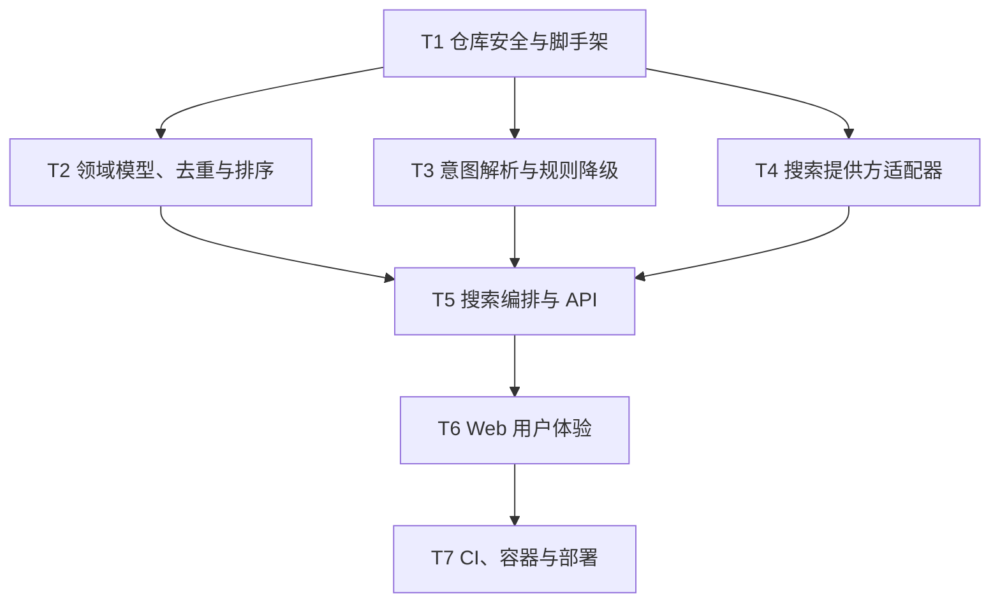

# QueryPilot Web MVP 实施计划

## 1. 计划状态

- 状态：等待产品与技术评审；
- 目标：在 2–3 小时内将现有桌面原型迁移为可部署的通用 AI 搜索 Web MVP；
- 规格来源：[`../docs/PRD.md`](../docs/PRD.md)；
- 技术设计：[`../docs/DEVELOPMENT.md`](../docs/DEVELOPMENT.md)；
- 执行原则：先解决密钥风险，再构建最短端到端链路；每个阶段结束时保持项目可运行。

## 2. 前置假设

1. 项目名暂定为 `QueryPilot`；
2. 使用 Python 3.11+、FastAPI、Jinja2 和原生 JavaScript；
3. DeepSeek 与 Tavily Key 可用；
4. 部署目标为国内轻量服务器（阿里云/腾讯云）；
5. MVP 不保存用户数据，不使用数据库；
6. 现有 `quark_search_gui.py` 仅作为迁移参考，不直接暴露为 Web 服务。

如果上述任一项改变，应先更新 PRD、开发文档和 ADR，再修改实现。

## 3. 依赖关系



在单人 2–3 小时实施条件下按顺序执行。T2、T3、T4 技术上可以并行，但接口应先由 T1 确定。

## 4. 架构决策

- 单体优先：一个 FastAPI 服务承载页面、API 和搜索编排，减少部署面；
- 适配器边界：DeepSeek、Tavily 等供应商响应不得进入核心领域模型；
- 部分成功：一个提供方失败不阻断其他结果；
- 确定性排序：MVP 不为每条结果调用 LLM，避免成本和延迟失控；
- 无持久化：搜索请求同步处理，不保存历史；
- 密钥外置：只通过环境变量和部署平台 Secret 管理。

## 5. 时间盒

| 时间 | 任务 | 可交付结果 |
| --- | --- | --- |
| 00:00–00:15 | T1 安全与脚手架 | 可启动的 FastAPI 空壳、无密钥提交风险 |
| 00:15–00:40 | T2 模型、去重与排序 | 可测试的核心纯函数 |
| 00:40–01:05 | T3 意图解析 | AI 解析与无 Key 降级可用 |
| 01:05–01:35 | T4 搜索适配器 | Tavily 返回统一结果 |
| 01:35–02:05 | T5 编排与 API | `/api/search` 端到端可用 |
| 02:05–02:35 | T6 Web 页面 | 可在线演示的完整用户流程 |
| 02:35–03:00 | T7 交付 | 测试、Docker、CI、部署和 README 校准 |

若时间不足，按以下顺序裁剪：实时进度 → 视觉动效。不得裁剪密钥处理、输入校验、失败降级、核心测试和健康检查。

## 6. 任务明细

### T1：仓库安全与 Web 脚手架

**描述：** 消除公开仓库的凭据风险，建立最小可启动工程和配置入口。

**验收标准：**

- [ ] 当前 `config.json` 中出现过的密钥已在服务商侧轮换；
- [ ] `.gitignore` 忽略 `.env`、`config.json`、`.venv`、缓存和编译产物；
- [ ] `.env.example` 不包含真实值；
- [ ] FastAPI 应用能够启动，`GET /health` 返回 200；
- [ ] 依赖和质量工具有明确、可复现的版本范围。

**验证：**

```powershell
python -m uvicorn app.main:app --port 8000
Invoke-WebRequest http://127.0.0.1:8000/health
python -m ruff check .
```

另运行秘密扫描，确认工作区和首个 Git 提交不含有效 Key。

**依赖：** 无。

**预计文件：** `.gitignore`、`.env.example`、`requirements.txt`、`app/main.py`。

**预计耗时：** 15 分钟，M。

### T2：领域模型、URL 去重与排序

**描述：** 定义稳定的数据契约，并将最关键的结果处理实现成无网络依赖的纯函数。

**验收标准：**

- [ ] 搜索请求、意图、结果、提供方状态和指标都有 Pydantic 模型；
- [ ] URL 规范化能移除追踪参数、fragment 和无意义末尾斜杠；
- [ ] 相同规范 URL 合并来源且不会重复展示；
- [ ] 评分限制在 0–100，排序结果稳定并生成可读理由。

**验证：**

```powershell
python -m pytest -q tests/test_ranking.py
```

**依赖：** T1。

**预计文件：** `app/models.py`、`app/services/ranking.py`、`tests/test_ranking.py`。

**预计耗时：** 25 分钟，M。

### T3：AI 意图解析与规则降级

**描述：** 将自然语言转换成类型化意图，并保证无 Key、超时或异常 JSON 时仍能搜索。

**验收标准：**

- [ ] DeepSeek 输出严格限制为 PRD 定义的字段和数量；
- [ ] 所有模型输出先经 Pydantic 校验；
- [ ] 超时、HTTP 错误、无效 JSON 和无 Key 均使用规则降级；
- [ ] 降级结果最多产生 3 个非空查询，响应标记 `fallback_used=true`。

**验证：**

```powershell
python -m pytest -q tests/test_intent.py
```

测试使用假 HTTP 客户端，不消耗真实额度。

**依赖：** T1、T2 中的模型契约。

**预计文件：** `app/config.py`、`app/services/intent.py`、`tests/test_intent.py`。

**预计耗时：** 25 分钟，M。

### 检查点 A：核心基础

- [ ] `/health` 可用；
- [ ] 意图、去重和排序测试通过；
- [ ] 没有真实 API Key 进入待提交文件；
- [ ] 无外部 API 时也能生成有效搜索计划。

### T4：Tavily 搜索适配器

**描述：** 建立统一提供方接口，将 Tavily 搜索结果转换为统一的原始结果模型（接口设计预留多源扩展）。

**验收标准：**

- [ ] 适配器遵循统一 `SearchProvider` 接口；
- [ ] 每个请求有明确超时、结果上限和稳定 User-Agent；
- [ ] 供应商字段只在适配器内部出现；
- [ ] HTTP、解析和限流错误转换为不含密钥的类型化错误；
- [ ] 单元测试覆盖成功、空结果和错误响应。

**验证：**

```powershell
python -m pytest -q tests/test_providers.py
```

**依赖：** T1、T2。

**预计文件：** `app/providers/base.py`、`app/providers/tavily.py`、`tests/test_providers.py`。

**预计耗时：** 25 分钟，M。

### T5：搜索编排与公开 API

**描述：** 连接意图解析、提供方和结果处理，交付第一个完整的 API 垂直切片。

**验收标准：**

- [ ] `POST /api/search` 接受 2–200 字符查询并返回 PRD 契约；
- [ ] 查询变体与提供方受控并发，总任务数存在上限；
- [ ] 单一提供方失败时返回 200 和其他结果；
- [ ] 全部提供方失败时返回不含堆栈的 503；
- [ ] 响应包含请求 ID、提供方状态、原始数量、去重数量和总耗时。

**验证：**

```powershell
python -m pytest -q tests/test_search_service.py tests/test_api.py
```

手工在 `/docs` 提交一个游戏查询，确认响应模型可读。

**依赖：** T2、T3、T4。

**预计文件：** `app/services/search.py`、`app/main.py`、`tests/test_search_service.py`、`tests/test_api.py`。

**预计耗时：** 30 分钟，M。

### T6：Web 搜索体验

**描述：** 用一个响应式页面展示输入、意图、查询变体、结果和流水线指标。

**验收标准：**

- [ ] 375px 与桌面宽度下均无横向溢出；
- [ ] 输入校验、加载、成功、部分成功、空结果和失败状态明确；
- [ ] 结果显示标题、摘要、来源、分数、理由和安全外链；
- [ ] 键盘可完成搜索，焦点可见，状态消息可被辅助技术感知；
- [ ] 页面不渲染未转义的第三方 HTML。

**验证：**

- 手工执行 PRD 中 3 个示例查询；
- 使用浏览器响应式模式检查 375px 和 1440px；
- 关闭一个提供方后确认部分失败状态仍展示结果。

**依赖：** T5。

**预计文件：** `app/templates/index.html`、`app/static/app.js`、`app/static/styles.css`。

**预计耗时：** 30 分钟，M。

### 检查点 B：端到端 MVP

- [ ] 三个示例查询可以从页面完成；
- [ ] 无 DeepSeek Key 时仍可搜索；
- [ ] 一个搜索源失败不影响另一个来源；
- [ ] 页面和 `/docs` 的数据契约一致；
- [ ] 测试与 lint 全部通过。

### T7：容器、CI、部署与项目交付

**描述：** 将已验证应用变成可复现、可在线访问的 GitHub 作品。

**验收标准：**

- [ ] Docker 镜像以非开发模式启动并正确读取平台 `PORT`；
- [ ] GitHub Actions 在推送和 PR 上运行 pytest、Ruff 和镜像构建；
- [ ] 国内轻量服务器在线服务通过 `/health`；
- [ ] README 加入真实 Demo URL、截图、限制和架构说明；
- [ ] 最终秘密扫描无告警，文档与实现一致。

**验证：**

```powershell
python -m pytest -q
python -m ruff check .
docker build -t querypilot .
docker run --env-file .env -p 8000:8000 querypilot
```

随后访问本地及线上 `/health`，并各执行一次 smoke test。

**依赖：** T6。

**预计文件：** `Dockerfile`、`.github/workflows/ci.yml`、`README.md`、部署配置文件（如需要）。

**预计耗时：** 25 分钟，M。

## 7. 最终完成定义

- [ ] PRD 中全部 P0 验收标准满足；
- [ ] 测试、lint、Docker 构建和线上 smoke test 通过；
- [ ] GitHub 仓库及历史中不存在有效密钥；
- [ ] README 可以让陌生人在 5 分钟内理解、运行和体验项目；
- [ ] 失败降级在演示中可复现；
- [ ] 已知限制和后续路线有明确记录；
- [ ] 评审人确认可以开始公开发布。

## 8. 风险与缓解

| 风险 | 等级 | 缓解措施 |
| --- | --- | --- |
| 旧密钥已经暴露 | 高 | 第一任务轮换密钥；提交前扫描工作树与历史 |
| 三小时无法完成全部范围 | 高 | 严格时间盒；先砍 P1、动画和第二搜索源 |
| 外部 API 导致测试不稳定 | 高 | 依赖注入、假适配器；测试禁止真实网络 |
| 国内服务器需备案/HTTPS 配置 | 中 | 提前申请域名与证书；仅 IP 访问可暂缓备案 |
| 搜索结果质量不可控 | 中 | 展示来源和启发式评分；不宣称事实保证 |
| 第三方条款或版权风险 | 中 | 使用正式 API/公开知识源；不迁移网盘抓取能力 |

## 9. 已确认决策（2026-08）

- [x] 项目名称：`QueryPilot`；
- [x] 部署平台：国内轻量服务器（阿里云/腾讯云），不使用 Render；
- [x] 首版搜索源：只接 Tavily，保留提供方接口；
- [x] README：仅中文。
- [ ] 评审并批准本计划后再进入实现阶段。

